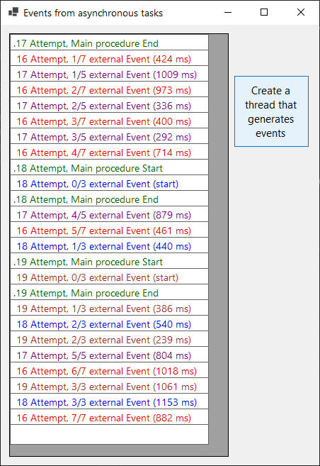

# NET_AsynchronousEvents application .NET8

NET_AsynchronousEvents application for generating and receiving messages from asynchronous threads.

## NET_AsynchronousEvents - Overview

The NET_AsynchronousEvents application shows the operation of the following mechanisms:

- Asynchronous work of threads,
- Delegates;
- Events;
- Publisher - Subscriber

The main window [Events from asynchronous tasks] by repeatedly pressing the button 
creates many external threads that "live" and generate messages themselves. 
The main window receives all messages simultaneously through the mechanisms 
of delegates, events and asynchronous tasks and displays them showing the events 
of each thread.

## NET_AsynchronousEvents - Operation of the application.

In this application, the 'AsyncPublisher' class defines a delegate through 
the signature of the 'eventDelegatPrint3' method. 

Then it establishes a variable - the cDelegat3 event of the eventDelegatPrint3 type. 
This variable will contain the addresses of remote methods that will be run 
when the cDelegat3 event is activated.

The WinForm Form1 class has a ListBox, which is a list of messages. After pressing 
the button in Form1, this class creates a local instance of the [cPublisher] 
AsyncPublisher class. Then it attaches its [EventPrintToGrid] method to 
the cPublisher.cDelegate3 delegate for writing messages to the ListBox. 
Then it runs the main action GenerateAction() of the [cPublisher] instance and Form1 
locally terminates.
The cPublisher instance works for a few seconds (randomly), it is asynchronous, 
so it works in a new thread.

When the button is pressed several times and quickly - several parallel instances 
of [cPublisher] will work in the background.
It then looks like this: Form1 listens and external threads of several 
[cPublisher] instances generate messages to the cDelegat3 delegate from time to time. 
Form1, through the attached event [EventPrintToGrid], writes all messages 
from all threads to one ListBox. We then see in it the ‘green’ messages from Form1 
starting and the colored messages from threads that arrive at different times and intertwine.

This can be seen in the figure above.

